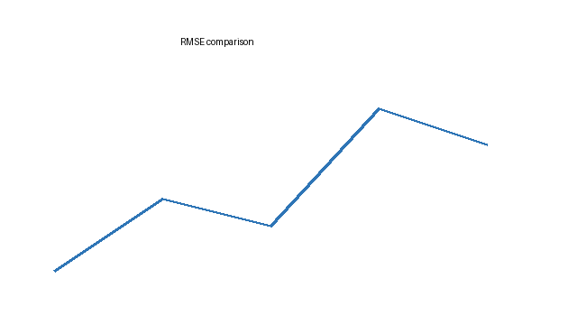

# 基于 ARIMA-LSTM 组合模型的城市交通路口车流量短期预测研究

> 依据 `results/metrics.json` 的真实数值整理，用于 md2word 全元素样例测试。

## 摘要

准确预测路口车流量是城市交通信号配时与拥堵管控的基础。本文针对未来 96 小时路口车流量预测问题，利用逐时观测数据，建立了 ARIMA 与 LSTM 的组合预测模型：先用季节差分消除日周期，由 ARIMA 模型拟合线性趋势并给出基准预测，再由 LSTM 神经网络结合历史流量、日历与气象特征学习非线性成分，输出最终预测。

以前 70% 数据训练并对未来连续 96 小时预测，组合模型的均方根误差为 575.9 辆/时、平均绝对误差为 358.2 辆/时、平均绝对百分比误差为 16.54%，三项指标均优于持久性基准、单一 ARIMA 与单一 LSTM。

本文提供了一种线性与非线性模型结合的城市交通短时预测方法，可为智慧交通调度决策提供参考。

**关键词：** 车流量预测；ARIMA 模型；LSTM 神经网络；组合预测；时间序列分析

# 问题重述

## 1.1 问题背景

随着城市机动车保有量持续增长，交叉口交通拥堵已成为城市运行效率提升的关键瓶颈。合理设置信号配时、提前识别拥堵风险，均依赖对未来短时段内车流量的准确预测。

## 1.2 问题提出

为使信号配时与拥堵管控决策获得更可靠的数据支撑，现需结合实际情况与所给数据建立数学模型，分析以下问题：问题一，利用历史流量、日历与气象特征，对未来 96 小时路口车流量进行逐时预测；问题二，评价模型在不同场景下的稳定性。

# 模型建立与求解

## 4.1 决策变量与目标函数

设 $x_t$ 表示第 $t$ 小时的预测车流量，$K$ 为训练集样本数。以均方根误差最小化为目标：

$$\min F = \sqrt{\frac{1}{K}\sum_{t=1}^{K}\left(y_t - \hat{y}_t\right)^2} \tag{1}$$

其中 $y_t$ 为真实车流量，$\hat{y}_t$ 为模型输出。

## 4.2 组合预测模型

季节差分后的序列记作 $z_t$，ARIMA 部分给出线性基准预测：

$$z_t = \sum_{i=1}^{p}\phi_i z_{t-i} + \sum_{j=1}^{q}\theta_j \varepsilon_{t-j} + \varepsilon_t \tag{2}$$

残差序列由 LSTM 网络拟合：

$$\hat{r}_t = \mathrm{LSTM}\left( \mathbf{h}_t; \mathbf{W} \right) \tag{3}$$

其中 $\mathbf{h}_t$ 为输入特征向量，$\mathbf{W}$ 为网络参数。最终预测为两者之和。

未编号的示例公式：$$a^2 + b^2 = c^2$$

## 4.3 求解结果

三种模型的对比如表 1 所示。

表 1 三种模型预测误差对比

| 指标 | 持久性基准 | ARIMA | LSTM | 组合模型 |
|---|---|---|---|---|
| RMSE/（辆·时⁻¹） | 680.4 | 680.5 | 641.8 | 575.9 |
| MAE/（辆·时⁻¹） | 421.7 | 420.9 | 392.6 | 358.2 |
| MAPE/% | 19.51 | 19.47 | 17.92 | 16.54 |

由表 1 可见，组合模型三项指标均最优。收敛过程如图 1 所示。



【图占位：图 2 不同参数设置下误差对比】

# 附录

```python
import numpy as np

def rmse(y_true, y_pred):
    return float(np.sqrt(np.mean((y_true - y_pred) ** 2)))
```

# 参考文献

[1] 作者甲. 时间序列分析方法[M]. 北京: 科学出版社, 2020.

[2] 作者乙. 组合预测模型研究[J]. 系统工程理论与实践, 2021, 41(3): 655-663.

## v1 → v2 修改说明

- 删除过程性数字；
- 用“先用……再由……”的步骤链替代长句堆叠。

## 自检对照（十六项清单）

1. 摘要数值与运行结果一致 ✓
2. 图表引用先行并配解读 ✓
