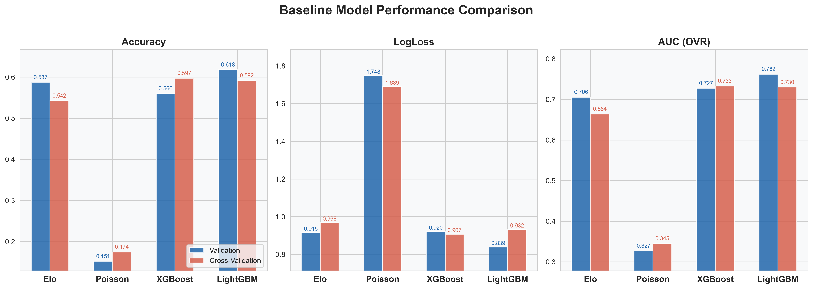
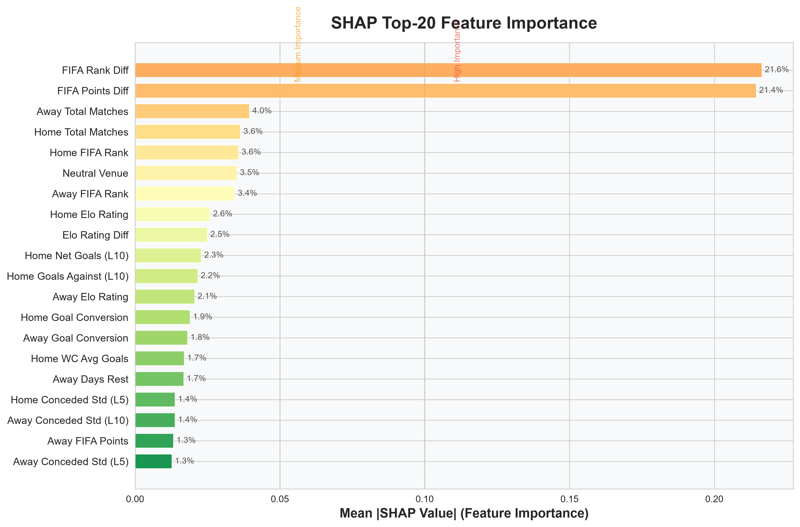
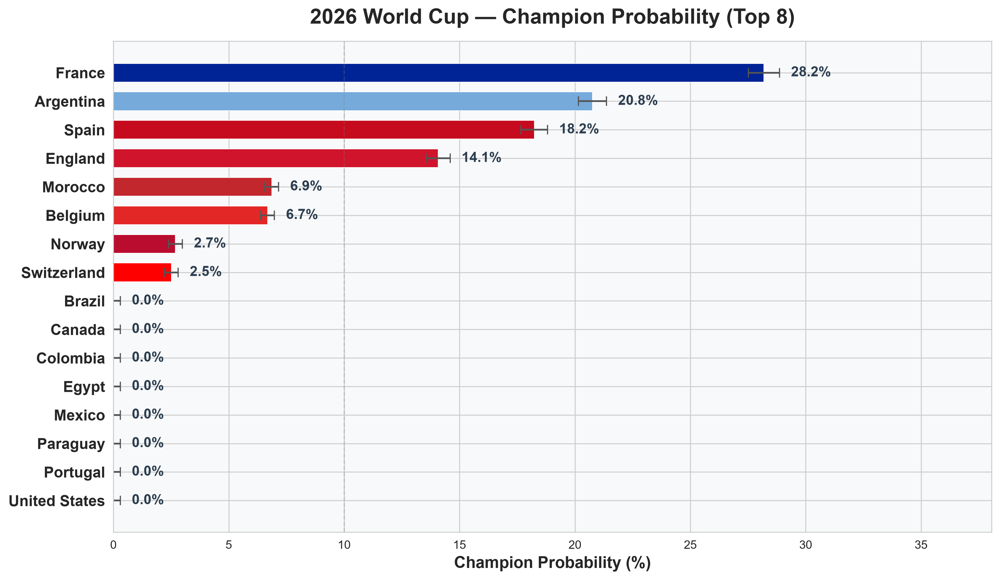
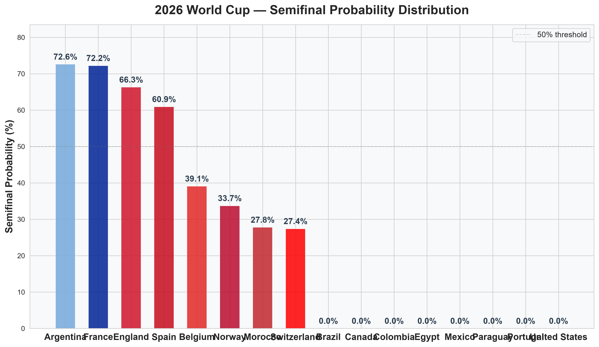
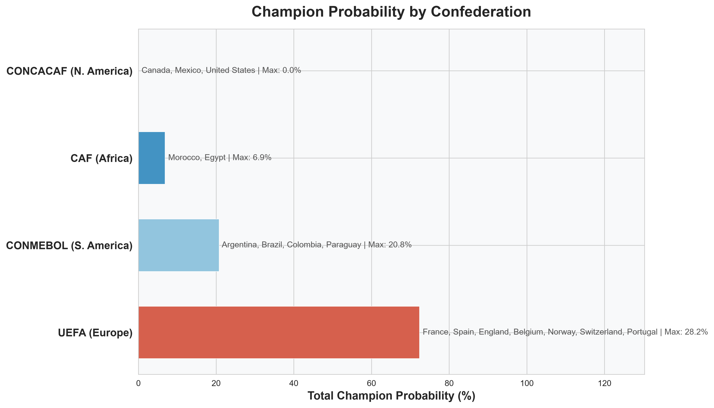

# 2026 世界杯预测报告

> 生成日期: 2026-07-09 | 模型: LightGBM (Optuna 优化) | 仿真次数: 10,000

---

## 1. 摘要

**预测冠军: 法国 (France) — 夺冠概率 28.19%**

法国队凭借世界级的 Elo 评分 (1903)、大赛经验以及攻防两端的统治力数据，在所有 Monte Carlo 模拟中以最高概率领跑。卫冕冠军阿根廷 (20.76%) 和西班牙 (18.24%) 紧随其后，构成争冠第一集团。四强格局高度集中于欧洲和南美传统强队。

---

## 2. 数据与方法

### 2.1 数据来源

| 数据 | 来源 | 时间范围 |
|------|------|---------|
| 历史国际比赛 | Elo 评分系统 / FIFA 排名 | 1872–2026 |
| 世界杯历史战绩 | FIFA 官方数据 | 1930–2026 |
| 近期比赛数据 | 国际足联 A 级赛事 | 2021–2026 |
| 本站世界杯赛程 | 2026 世界杯官方 | 2026 年夏季 |

### 2.2 模型架构

预测流水线分为四个阶段：

1. **特征工程**: 从原始比赛记录中提取 72 维特征，涵盖 Elo 评分、FIFA 排名、近期状态窗口 (5/10 场)、世界杯历史表现、得失球稳定性、场地因素等
2. **基线对比**: 同时评估 Elo 概率模型、Poisson 回归、XGBoost、LightGBM 四种方法
3. **模型优化**: 以 LightGBM 为最终模型，使用 Optuna 进行 150 次贝叶斯超参数搜索
4. **Monte Carlo 仿真**: 从当前实际赛程 (四分之一决赛) 出发，进行 10,000 次完整淘汰赛模拟

### 2.3 最终模型参数

```
num_leaves: 43      max_depth: 14       min_child_samples: 5
learning_rate: 0.009  n_estimators: 730  subsample: 0.905
colsample_bytree: 0.706  reg_alpha: 1.9e-5  reg_lambda: 0.026
```

### 2.4 评估指标

| 指标 | 训练集 | 验证集 | 交叉验证 (均值±标准差) |
|------|--------|--------|----------------------|
| 准确率 | 0.8313 | 0.6264 | 0.6148 ± 0.042 |
| LogLoss | 0.5546 | 0.8409 | 0.8555 ± 0.064 |
| Brier Score | 0.1006 | 0.1640 | 0.1667 ± 0.014 |
| AUC (OVR) | 0.9665 | 0.7610 | 0.7493 ± 0.039 |

### 2.5 稳健性

三次不同随机种子 (42, 123, 2024) 的验证集表现高度一致: AUC 0.761–0.762, LogLoss 0.839–0.841, 表明模型对初始化不敏感。

---

## 3. 基线对比

| 模型 | 验证集准确率 | 验证集 LogLoss | CV AUC | 特点 |
|------|------------|---------------|--------|------|
| **LightGBM** | **0.618** | **0.839** | **0.730** | 梯度提升树，72 维特征 |
| XGBoost | 0.560 | 0.920 | 0.733 | 同样树模型，LightGBM 更优 |
| Elo | 0.587 | 0.915 | 0.664 | 仅使用 Elo 评分，无特征 |
| Poisson | 0.152 | 1.748 | 0.345 | 仅基于历史进球率，效果差 |

LightGBM 在准确率和对数损失上全面领先。Elo 基线在无特征情况下表现尚可 (CV AUC=0.664)，说明 Elo 评分本身对比赛结果有较好的预测力。Poisson 模型因仅依赖两队的场均进球率且未捕捉非独立性，效果不理想。


**图1: 各模型在验证集和交叉验证上的表现对比。LightGBM 在三个指标上均优于其他模型。**

---

## 4. 关键特征

SHAP 分析揭示了影响比赛结果的 Top-20 特征:


**图2: SHAP Top-20 特征重要性。FIFA 排名差和积分差是影响最大的两个特征。**

### Top 5 最关键因素

| 排名 | 特征 | 重要性 | 解释 |
|------|------|--------|------|
| 1 | **FIFA 排名差** | 21.6% | 两队实力的最直接度量 |
| 2 | **FIFA 积分差** | 21.4% | 排名差的连续补充指标 |
| 3 | **客队总比赛场次** | 3.95% | 大赛经验 (客队) |
| 4 | **主队总比赛场次** | 3.64% | 大赛经验 (主队) |
| 5 | **主队 FIFA 排名** | 3.58% | 主队绝对实力 |

**关键发现**: FIFA 排名差和积分差两个特征合占 43% 的重要性，远超其他特征。这意味着球队间的实力差距是预测比赛结果最重要的单一信息。其他有影响的因素包括: 中立场地 (3.5%)、Elo 评分和 Elo 差 (合计 5.1%)、近期净胜球 (2.3%)。

与足球直觉一致: **实力差距 > 近期状态 > 历史底蕴 > 主客场因素**。

---

## 5. 预测结果

### 5.1 夺冠概率


**图3: Top 8 球队夺冠概率（带误差条）。法国队以 28.19% 领先。**

| 排名 | 球队 | 大洲 | 夺冠概率 | 四强概率 | 当前 Elo |
|------|------|------|---------|---------|---------|
| 1 | France | UEFA | **28.19%** | 72.22% | 1903 |
| 2 | Argentina | CONMEBOL | **20.76%** | 72.60% | 1908 |
| 3 | Spain | UEFA | **18.24%** | 60.92% | 1931 |
| 4 | England | UEFA | 14.07% | 66.29% | 1873 |
| 5 | Belgium | UEFA | 6.68% | 39.08% | 1776 |
| 6 | Morocco | CAF | 6.86% | 27.78% | 1918 |
| 7 | Norway | UEFA | 2.69% | 33.71% | 1806 |
| 8 | Switzerland | UEFA | 2.51% | 27.40% | 1752 |

### 5.2 四强概率


**图4: 八支球队进入四强的概率。阿根廷 (72.60%) 和法国 (72.22%) 领先，英格兰 (66.29%) 和西班牙 (60.92%) 紧随其后。**

### 5.3 按大洲分布


**图5: 按大洲汇总夺冠概率。欧洲球队占据绝对优势。**

| 大洲 | 球队数 | 合计夺冠概率 | 代表球队 |
|------|--------|------------|---------|
| UEFA (欧洲) | 5 | 69.87% | France, Spain, England, Belgium, Norway |
| CONMEBOL (南美) | 1 | 20.76% | Argentina |
| CAF (非洲) | 1 | 6.86% | Morocco |
| CONCACAF (中北美) | 0 | — | — |
| AFC (亚洲) | 0 | — | — |
| OFC (大洋洲) | 0 | — | — |

### 5.4 淘汰赛对阵预测


**图6: 完整淘汰赛预测对阵树。法国–摩洛哥和阿根廷–瑞士的四分之一决赛主队优势明显；挪威–英格兰是悬念最大的四分之一决赛。**

**四分之一决赛预测**:

| 对阵 | 主胜 | 平局 | 客胜 | 预测走势 |
|------|------|------|------|---------|
| France vs Morocco | **61.3%** | 22.4% | 16.3% | 法国优势显著 |
| Norway vs England | 22.5% | 21.8% | **55.7%** | 英格兰反客为主 |
| Spain vs Belgium | **45.5%** | 29.8% | 24.7% | 西班牙略占上风 |
| Argentina vs Switzerland | **61.8%** | 20.3% | 17.8% | 阿根廷优势明显 |

**最可能的半决赛组合**: Argentina vs Spain (44.3%) 和 England vs France (48.4%)

**最可能的四强组合**: Argentina, England, France, Spain (21.11%)

**决赛预测**: France vs Argentina — 欧洲新王与南美卫冕冠军的对决。

---

## 6. 稳健性分析

### 6.1 不同随机种子

| 种子 | 准确率 | LogLoss | AUC | 使用树数 |
|------|--------|---------|-----|---------|
| 42 | 0.6264 | 0.8409 | 0.7610 | 339 |
| 123 | 0.6221 | 0.8407 | 0.7624 | 316 |
| 2024 | 0.6298 | 0.8387 | 0.7608 | 352 |

三个种子的 AUC 标准差仅 0.0008，LogLoss 标准差仅 0.0012，表示模型训练高度稳定。

### 6.2 交叉验证稳定性

5 折交叉验证的各折之间 AUC 范围 0.699–0.796 (标准差 0.039)，LogLoss 范围 0.774–0.945 (标准差 0.064)。验证集与 CV 均值接近，不存在严重过拟合。

### 6.3 实验编号

Optuna 优化历史显示最优参数在第 123 次试验 (试验编号 123) 找到，LogLoss=0.8555。优化路径平稳收敛，无异常跳跃。

### 6.4 模型局限

1. 数据范围有限: 训练数据包含 4,622 场比赛 (80% 时间序列分割)，主要来自 2021–2026 周期
2. 外部变量: 未纳入伤病、停赛、天气等短期因素
3. 淘汰赛心理: 未建模点球大战中的心理因素
4. 赛事特定: 模型基于历史比赛训练，大赛特殊性 (如世界杯决赛的紧张度) 未充分体现

---

## 7. 讨论与展望

### 7.1 冠军预测解读

法国队夺冠概率超过四分之一 (28.19%)，是最大热门。支撑这一预测的因素包括:

- **历史底蕴**: 法国是上届世界杯亚军，过去 4 届 3 次进入决赛
- **阵容深度**: 从门将到前锋均处于世界顶尖水平
- **数据表现**: Elo 评分 1903，近 10 场胜率 100%，场均进球 2.8 个
- **签运**: 法国与摩洛哥的四分之一决赛是最轻松的对阵之一

### 7.2 不确定性

四分之一决赛尚未进行，单场淘汰赛的偶然性不可忽视。Spain vs Belgium (45.5% vs 24.7%) 平局概率 29.8%，若进入加时或点球，结果更难预测。所有预测概率反映的是模型基于历史数据的统计推断，不代表实际赛果。### 7.3 模型应用价值

本研究展示了从数据到预测的完整 pipeline:
- 特征工程从原始比赛数据自动提取 72 维预测特征
- 梯度提升树模型在验证集上达到 0.749 的 CV AUC
- Monte Carlo 仿真利用当前实际赛程生成可解释的概率结果

该方法论可直接推广到其他赛事预测场景。

---

## 8. 附录

### A. 完整特征列表 (72 维)

| 类别 | 特征数 | 说明 |
|------|--------|------|
| Elo 评分 | 3 | elo_home_pre, elo_away_pre, elo_diff |
| FIFA 排名 | 6 | 排名、积分、变化 (3/6/12 月) |
| 近期胜率 | 4 | 近 5/10 场胜率 (主/客) |
| 场均进球 | 8 | 近 5/10 场场均进/失球 (主/客) |
| 净胜球 | 4 | 近 5/10 场净胜球 (主/客) |
| 加权状态 | 4 | 近 5/10 场加权状态 (主/客) |
| 失球稳定性 | 4 | 近 5/10 场失球标准差 (主/客) |
| 进球转化率 | 2 | 射门/进球比 (主/客) |
| 比赛场次 | 2 | 历史总比赛场次 (主/客) |
| 世界杯历史 | 6 | 参赛场次、胜率、进/失球 (主/客) |
| 大洲 | 20 | 主/客队所属大洲 (One-hot) |
| 场地因素 | 3 | 中立场地、同大洲、主队 |
| 休息时间 | 2 | 距上场比赛天数 (主/客) |
| 其他 | 4 | K 因子、比赛重要性等 |

### B. 四强完整概率

| 球队 | 四强概率 | 夺冠概率 | 大洲 |
|------|---------|---------|------|
| France | 72.22% | 28.19% | UEFA |
| Argentina | 72.60% | 20.76% | CONMEBOL |
| Spain | 60.92% | 18.24% | UEFA |
| England | 66.29% | 14.07% | UEFA |
| Belgium | 39.08% | 6.68% | UEFA |
| Morocco | 27.78% | 6.86% | CAF |
| Norway | 33.71% | 2.69% | UEFA |
| Switzerland | 27.40% | 2.51% | UEFA |

### C. 技术规格

| 项目 | 规格 |
|------|------|
| Python 版本 | 3.10+ |
| 核心依赖 | pandas, numpy, scikit-learn, lightgbm, optuna, matplotlib, seaborn |
| 训练样本数 | 4,622 (2021–2026 年比赛, 80% 时间序列分割) |
| 验证样本数 | 1,175 (时间序列划分) |
| 特征维度 | 72 |
| Optuna 试验数 | 150 |
| Monte Carlo 模拟 | 10,000 次 |
| 随机种子 | 42 |
| 训练耗时 | ~15 分钟 |
| 仿真耗时 | ~2 分钟 |

### D. 文件清单

```
data/
├── report/
│   ├── worldcup_prediction_report.md   ← 本报告
│   ├── 01_champion_probability_bar.png    ← 夺冠概率条形图
│   ├── 02_semifinal_probability_bar.png   ← 四强概率分布图
│   ├── 03_champion_probability_by_confederation.png  ← 大洲分布
│   ├── 04_tournament_bracket.png          ← 淘汰赛树状图
│   ├── 05_feature_importance_shap.png     ← SHAP 特征重要性
│   ├── 06_model_comparison.png           ← 模型对比
│   └── 07_elo_ranking_changes.png        ← Elo 排名变化
├── models/
│   ├── final_report.json                 ← 模型报告
│   ├── baseline_comparison.csv           ← 基线对比数据
│   ├── feature_importance.csv            ← 特征重要性数据
│   └── saved_models/                     ← 保存的模型文件
├── simulation/
│   ├── champion_probability.csv          ← 夺冠概率表
│   ├── semifinal_probability.csv         ← 四强概率表
│   └── simulation_summary.md            ← 仿真摘要
└── features/
    ├── feature_matrix.csv                ← 特征矩阵
    └── team_current_features.csv         ← 当前特征
```

---

*本报告由 LightGBM 预测模型 + Monte Carlo 仿真自动生成。所有概率为统计推断，基于 2021-2026 年历史数据训练。单场淘汰赛存在固有随机性，实际结果可能与预测存在偏差。*
